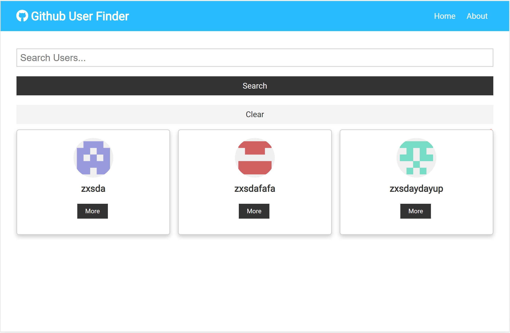
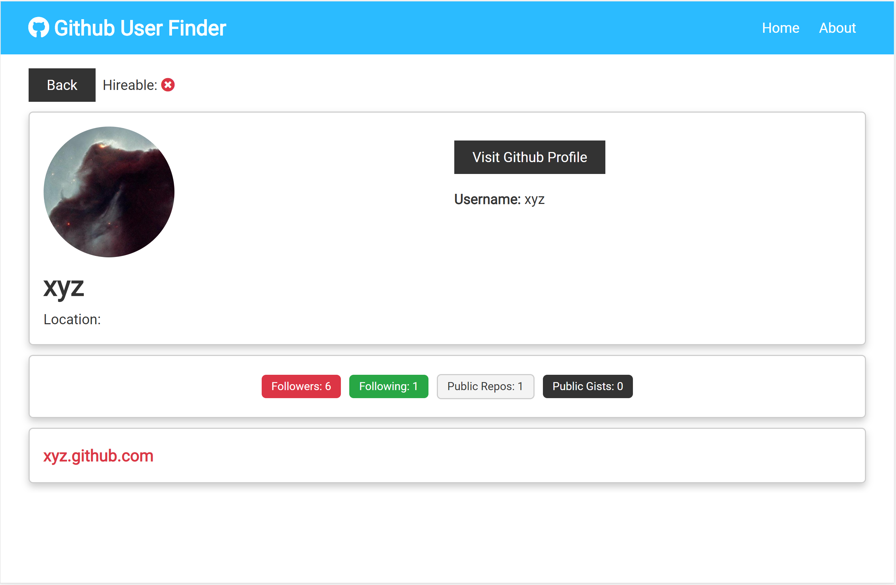

# Github user search

### [Live demo](https://usersearch1111.netlify.app/)

An application to search through github users using github API.

### Tech stack

- React.js (Hooks, ContextAPI, React routers)

### Installations

1. Install dependencies with `npm install`
2. Run app on localhost:3000 with `npm start`

# Features

- **Search User:** User can search for any github account and look for more details.

